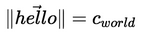

# katex-screenshot [](https://travis-ci.org/StandardCyborg/katex-screenshot)

Convert [KaTeX][] to images via screenshots

This was built to make generating images for Medium posts easier. Converts:

```tex
\|\vec{hello}\| = c_{world}
```

into



[KaTeX]: https://github.com/Khan/KaTeX

## Getting Started
To get started with our application, run the following:

```bash
# Install our package globally
npm install -g katex-screenshot

# Generate a .tex file to screenshot
echo "\\vec{hello} = \\vec{world}" > vector.tex

# Screenshot our .tex file
katex-screenshot vector.tex vector.tex.png
```

## Documentation
We provide a CLI via `katex-screenshot`:

```
  Usage: katex-screenshot [options] <infile.tex> <outfile.png>


  Options:

    -V, --version  output the version number
    -h, --help     output usage information
```

## Examples
### Converting multiple files
To convert multiple files, we recommend sticking to `bash`:

```bash
# For each of our input files
# DEV: We use `&` and `wait` to generate images in parallel
for filepath in *.tex; do
  # Generate a corresponding output file (e.g. foo.tex -> foo.tex.png)
  katex-screenshot "$filepath" "$filepath.png" &
done
wait
```

## Contributing
In lieu of a formal styleguide, take care to maintain the existing coding style. Add unit tests for any new or changed functionality. Lint via `npm run lint` and test via `npm test`.

## Unlicense
As of Oct 10 2017, Standard Cyborg has released this repository and its contents to the public domain.

It has been released under the [UNLICENSE][].

[UNLICENSE]: UNLICENSE
